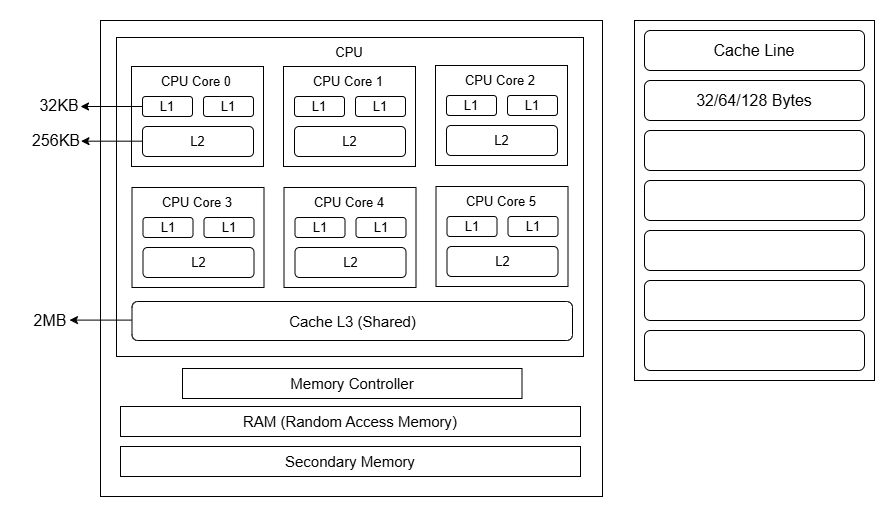
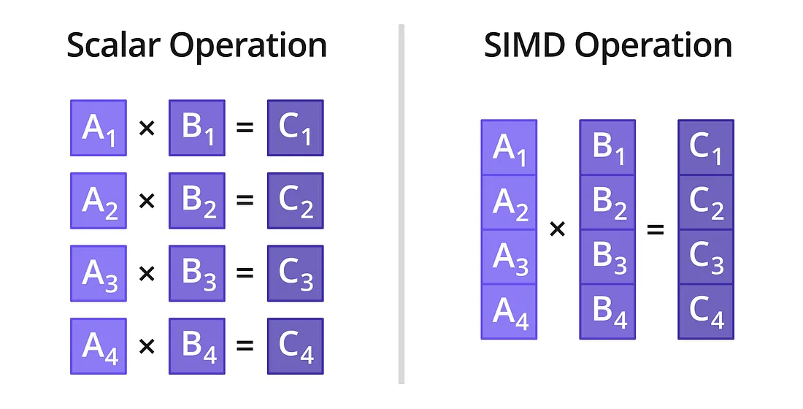
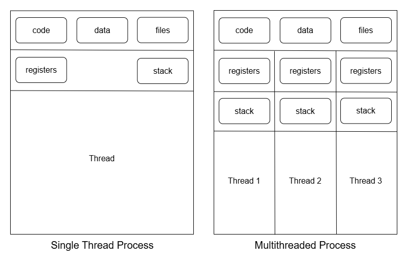
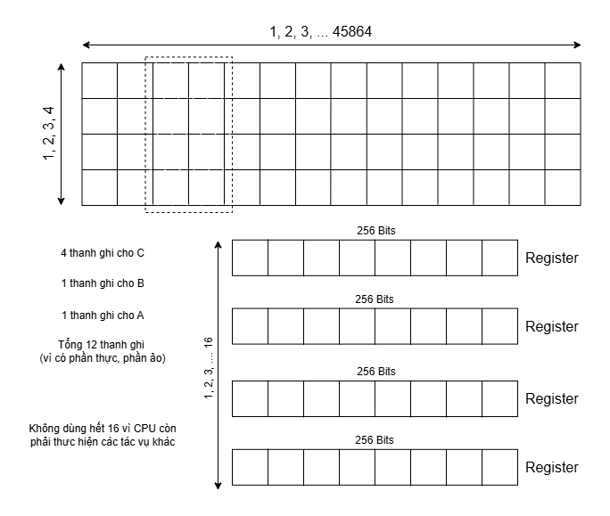
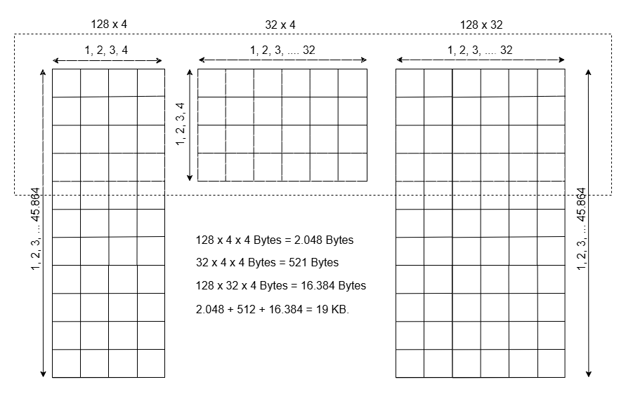
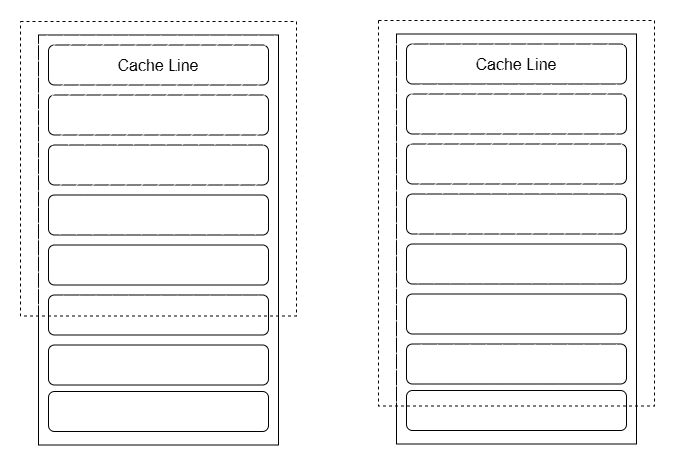

# Matrix Multiply Optimization

Tối ưu phép nhân ma trận phức số cho kênh PDSCH 5G NR theo chuẩn 3GPP.  
Cấu hình: **32T32R – 4 Layers – 100MHz** | Resource Grid: `3276 × 4` × `4 × 32` → `3276 × 32`

> Lưu ý: Nội dung trong repo này dựa trên kiến thức cá nhân, có thể không chính xác.

---

## Kiến trúc CPU.



- CPU Core (0 - 5): Hệ thống gồm 6 lõi vật lý thực tế chạy song song các luồng tính toán độc lập.

- Cache L1: Nằm sát core nhất, chia thành hai khối tách biệt: L1i (Instruction Cache - 32KB): Chuyên chứa mã máy/lệnh Assembly (lệnh AVX2 SIMD) chờ nạp vào pipeline.L1d (Data Cache - 32KB): Vùng lưu trữ dữ liệu thô. Đây là đích đến tối ưu hóa của chiến lược Tiling/Blocking.

- Cache L2: Bộ nhớ riêng của từng core, tốc độ thấp hơn L1 một chút nhưng dung lượng lớn hơn, làm vùng đệm hứng dữ liệu bị đẩy ra từ L1.

- Cache L3: Vùng nhớ đệm dùng chung cực lớn cho tất cả các core, đóng vai trò giảm thiểu số lần các core phải tranh chấp băng thông đi xuống RAM qua bus hệ thống.Cache Line (64 Bytes). CPU không bốc lẻ tẻ từng byte mà luôn nạp/xóa bộ nhớ theo các khối liên tục dung lượng đúng 64 Bytes.

---

## Intel Intrinsics - AVX



**Intrinsics** là các hàm tích hợp sẵn được cung cấp bởi trình biên dịch trong C/C++, cho phép lập trình viên gọi trực tiếp các tập lệnh hợp ngữ (assembly) cấp thấp mà không cần viết mã assembly thủ công. 

## Quy chuẩn đặt tên

`_mm<độ_rộng_bit>_<tên_thao_tác>_<kiểu_dữ_liệu>`


### 1. Kích thước thanh ghi

*   `_mm_`: Thanh ghi **128-bit** (SSE).
*   `_mm256_`: Thanh ghi **256-bit** (AVX/AVX2).
*   `_mm512_`: Thanh ghi **512-bit** (AVX-512).

### 2. Tên thao tác

*   `add`, `sub`, `mul`, `div`: Phép toán số học cơ bản (Cộng, trừ, nhân, chia).
*   `fmadd`: Fused multiply-add (Nhân rồi cộng biểu thức $A \times B + C$).
*   `load`, `store`: Tương tác bộ nhớ (Đọc từ bộ nhớ vào thanh ghi hoặc ghi từ thanh ghi ra bộ nhớ).
*   `set1`, `setzero`: Khởi tạo giá trị cho vector.

### 3. Kiểu dữ liệu 

*   `ps` (Packed Single): Số thực 32-bit (float). *Ví dụ: thanh ghi 256-bit chứa 8 số float.*
*   `pd` (Packed Double): Số thực 64-bit (double).
*   `epi8`, `epi16`, `epi32`, `epi64`: Số nguyên có dấu (Extended Packed Integer) 8, 16, 32, hoặc 64-bit.
*   `epu8`, `epu16`, `epu32`: Số nguyên không dấu (Unsigned).
*   `si128`, `si256`: Signed Int.

## 2. Intrinsics Life Cycle

* Bước 1: Load / Initialize 
* Bước 2: Compute / Process
* Bước 3: Store / Extract

## 3. Memory Alignment

Trong C, RAM bố trí như một chuỗi bit liên tục, còn CPU thì không. Nó đọc RAM theo từng khối cố định, thường được quyết định bởi kiến trúc bus và cache (ví dụ: các khối 32 byte hoặc 64 byte).

Với thanh ghi AVX (256-bit = 32 bytes), CPU thích nhất là được lấy một khối dữ liệu có địa chỉ bắt đầu là bội số của 32 (0, 32, 64, 96...). Đây là Memory Alignment.

---

## GCC Build Options Flags

### Các cờ -ON (O0 O1 O2 O3)

- O0: Không tối ưu, mặc định của gcc
    + Cách hoạt động: GCC dịch thẳng từng dòng code C sang mã máy tương ứng. Không sắp xếp lại lệnh, không xóa code thừa.

    + Ưu điểm: Thời gian biên dịch cực kỳ nhanh. Việc gỡ lỗi (debug) bằng gdb rất dễ dàng vì mỗi dòng code C khớp chính xác với một cụm mã máy.

    + Nhược điểm: Chương trình chạy chậm nhất, tốn nhiều bộ nhớ nhất.

- O1: Tối ưu cơ bản
    + Cách hoạt động: Bật một số thuật toán tối ưu đơn giản như: *xóa các biến không bao giờ được dùng đến*, *gom các biểu thức toán học tính toán trùng lặp*.

- O2: Tối ưu tiêu chuẩn
    + Cách hoạt động: Bật gần như mọi kỹ thuật tối ưu hóa mã lệnh, ngoại trừ những kỹ thuật làm file thực thi (binary) phình to ra.

    + Các phép tối ưu: *Tính toán trước biểu thức*, *Inline các hàm nhỏ -> giảm function call*, *Loop optimization*, *Biến hay dùng được đưa thẳng vào thanh ghi*.

    + Ưu điểm: Chương trình chạy rất nhanh, kích thước file nhỏ gọn, an toàn và ít xảy ra lỗi do trình biên dịch nội suy sai.

- O3: Tối ưu cực đại
    + Cách hoạt động: Kế thừa mọi thứ của -O2 và bật thêm các kỹ thuật tối ưu như: *Loop Unrolling: Bung vòng lặp*, *Auto-vectorization:Tự động gom các phép tính tuần tự để nhét vào các thanh ghi SIMD*.

---

## Multithreading



###

### Thread Pool Pattern (Khởi tạo 1 lần - Dùng mãi mãi)

Việc tạo và hủy thread liên tục gây ra overhead (độ trễ) rất lớn cho hệ điều hành. Để giải quyết vấn đề này thì khởi tạo toàn bộ threads 1 lần và dùng sau đó
* Khởi tạo toàn bộ threads một lần duy nhất lúc bắt đầu ứng dụng (`init_thread_pool`).
* Các threads tồn tại trong vòng lặp vô hạn. Khi không có tác vụ, chúng rơi vào trạng thái sleep (0% CPU). Khi có tác vụ, chúng lập tức thức dậy làm việc.

### Các hàm thông dụng
Hệ thống thao tác trực tiếp với POSIX Threads (`pthreads`) thay vì các thư viện bậc cao để kiểm soát tối đa hiệu năng. Các hàm cốt lõi được sử dụng bao gồm:

* **`pthread_create`:**: Tạo ra thread mới.
* **`pthread_join`:**: Chờ thread kết thúc. Thread gọi hàm này sẽ bị block cho đến khi thread được thực thi xong. Đây là cách để gom kết quả lại hoặc đảm bảo chương trình không thoát trước khi các thread con chạy xong.
* **`pthread_detach`:**: Tách rời một Thread. Nếu gọi hàm này, Thread sẽ chạy độc lập ở background. Khi nó chạy xong, hệ điều hành sẽ tự động thu hồi tài nguyên mà không cần ai phải gọi **pthread_join** để chờ nó.

* **`pthread_mutex_init`**: Khởi tạo một biến mutex.
* **`pthread_mutex_destroy`**: Hủy mutex để giải phóng tài nguyên sau khi không dùng nữa.
* **`pthread_mutex_lock` / `pthread_mutex_unlock`:**
  * Được sử dụng để đồng bộ hóa quyền truy cập vào các biến dùng chung.

* **`pthread_cond_wait`:**
  * Đưa thread vào trạng thái block/sleep (tiêu thụ 0% CPU) và tự động nhả khóa Mutex hiện tại.

* **`pthread_cond_init`**: Khởi tạo biến điều kiện.
* **`pthread_cond_wait`**: Bắt Thread hiện tại nhả khóa mutex ra và đi vạo trạng thái sleep, chờ đến khi có "tín hiệu" đánh thức. Khi được đánh thức, thread sẽ bắt đầu sau hàm **pthread_cond_wait**.
* **`pthread_cond_signal`**: Đánh thức một Thread đang trong trạng thái sleep trên biến điều kiện này.
* **`pthread_cond_broadcast`**: Đánh thức tất cả các Thread đang trong trạng thái sleep trên biến điều kiện này.
* **`pthread_cond_destroy`**: Hủy biến điều kiện.

### Những điểm cần lưu ý

- **Deadlock**: Deadlock xảy ra khi hai hay nhiều Threads chờ đợi lẫn nhau giải phóng tài nguyên, dẫn đến hệ thống bị treo vĩnh viễn. Để tránh cái này thì nên làm việc theo 1 chiều thống nhất.

- **Spurious Wakeup**: Thread trong trạng thái sleep có thể bị đánh thức ngay cả khi không có Thread nào gọi hàm **signal** hay **broadcast**. Để tránh tình trạng này thì nên dùng vòng while để check biến điều kiện.

---

## Tối ưu nhân ma trận trong repo này

### Các phương pháp được sử dụng

1. Cách nhân ma trận truyền thống. Lặp theo 3 vòng lặp i j k.
2. Đổi thứ tự vòng lặp i k j để tận dụng cache L1.
3. Đổi thứ tự vòng lặp ikj và chia nhỏ block multiplication.
4. Đổi thứ tự vòng lặp ikj + chia nhỏ block multiplication + sử dụng SIMD.
5. Đổi thứ tự vòng lặp ikj + sử dụng SIMD.
6. Đổi thứ tự vòng lặp ikj + chia nhỏ block multiplication + sử dụng SIMD + Multithreading
7. Đổi thứ tự vòng lặp ikj + sử dụng SIMD + Multithreading

### Cách tối ưu

#### Tính toán các thông số

##### Thanh ghi YMM



- Mỗi core có tối đa 16 thanh ghi YMM. Mỗi thanh ghi có dung lượng 256-bit (tương đương 32 bytes).
- Vì kiểu dữ liệu được sử dụng là `int16_t` (2 bytes), một thanh ghi YMM có thể chứa vừa vặn 16 phần tử cùng lúc.
- Để giảm thiểu việc truy xuất bộ nhớ, ta sẽ tính toán một khối nhỏ của ma trận C (có kích thước Mr hàng và Nr cột) trực tiếp trên các thanh ghi YMM.

- Ma trận C: Với kích thước 4 x 16, ta cần 4 thanh ghi để chứa phần Thực (Real) và 4 thanh ghi để chứa phần Ảo (Imag). Tổng cộng: 8 thanh ghi.
- Ma trận B: Cần nạp 16 phần tử Thực và 16 phần tử Ảo. Tổng cộng: 2 than ghi.
- Ma trận A: Mỗi vòng lặp, ta lấy ra 1 phần tử Thực và 1 phần tử Ảo của A, sau đó nhân bản (broadcast) chúng ra lấp đầy toàn bộ thanh ghi **YMM (_mm256_set1_epi16)**. Tổng cộng: 2 thanh ghi.

##### Cache L1



- Kích thước L1 Data Cache: Hầu hết các CPU có Cache L1 từ 32KB đến 48KB mỗi core.

- Để tránh hiện tượng L1 Thrashing (xóa/đẩy Cache Line liên tục do bị đầy), tổng dung lượng của 3 khối A, B, và C trong mỗi chu kỳ tính toán chỉ nên chiếm khoảng 50% đến 75% L1 Cache.

- Cache Locality: Ta cần chia nhỏ ma trận A, B, C thành các khối (block) có kích thước Mc x Kc, Kc x Nc và Mc x Nc. Với số phức `int16_t` (cần nhân đôi mảng và mỗi phần tử 2 bytes), tổng dung lượng d  chiếm trong L1 được tính bằng:
  + Mỗi phần tử chiếm 2 bytes (16 bits), và 2 phần thực ảo nên tổng là 4 bytes.
  + Tổng Size = 4 x (Mc.Kc + Kc.Nc + Mc.Nc)
  + Vì phép nhân ma trận trong PHY Layer là giữa Resource Grid trong 1 slot (45864 x 4) và Precoding Matrix (4 x 32). Tham số 4 và 32 khá nhỏ nên không cần phải chia nhỏ, vì vậy tham số cần tính là Mc. 
  + Nên chọn giá trị Mc là bội số của 64 (thường Cache line của L1 là 64 bytes) để tránh hiện tượng False Sharing. 
    * Với Mc = 64: tổng size là 9.5KB, chiếm 30%.
    * Với Mc = 128: tổng size là 19KB, chiếm 60%.
    * Với Mc = 192: tổng size là 28KB, chiếm 85%.
  


### Chạy repo

#### Cấu trúc thư mục

```
.
├── build/               # Output của quá trình biên dịch
│   └── multiplyMatrix   # Binary thực thi (được tạo bởi make)
│
├── images/              # Hình ảnh minh họa, sơ đồ kiến trúc
│
├── logs/                # Kết quả benchmark và log chạy thực tế
│
├── scripts/             # Script tiện ích (benchmark, sweep, ...)
│
├── .gitignore           # Các file/thư mục không track bằng git
├── Makefile             # Build system – xem hướng dẫn bên dưới
├── multiplyMatrix.c     # Toàn bộ source code các thuật toán
├── note.txt             # Ghi chú phát triển, số liệu thô
└── Readme.md            # File này
```

#### Build & chạy

```bash
make        # biên dịch → build/matmul
make run    # biên dịch và chạy benchmark
make clean  # xóa thư mục build/
```

**Yêu cầu:** GCC với support `-mavx2`, Linux/pthreads.

#### Kết quả benchmark (tham khảo)

Chạy trên CPU hỗ trợ AVX2 với `M=3276, K=4, N=32, NUM_THREAD=8`:

```
1. Basic ijk                ~baseline
2. Basic ikj                ~3–4×  faster
3. Block ikj                ~4–5×  faster
4. AVX2 No-Block            ~10×   faster
5. AVX2 Block               ~12×   faster
6. ThreadPool AVX2+Block    ~60×   faster
7. ThreadPool AVX2 NoBl     ~55×   faster
```

#### Kiểm tra các cờ tối ưu -O0 -O1 -O2 -O3.
``` bash
bash ./scripts/benchmarkFlags.sh
```

#### Sweep để tìm giá trị tối ưu.

### Run code on the EC2 Instance

- Install gcc and git.

```bash
sudo dnf update -y
sudo dnf install -y gcc gcc-c++ git make
```

- Check

```bash
gcc --version
g++ --version
git --version
make --version
```

---

## Câu lệnh
gcc multiplyMatrixAMX2.c -O2 -mavx2 -march=native -fopt-info-loop-optimized -c
gcc multiplyMatrixAMX2.c -O3 -mavx2 -march=native -fopt-info-loop-optimized -c

gcc multiplyMatrixAMX2.c -O2 -mavx2 -march=native -S -fverbose-asm -o code_O2.s
gcc multiplyMatrixAMX2.c -O3 -mavx2 -march=native -S -fverbose-asm -o code_O3.s